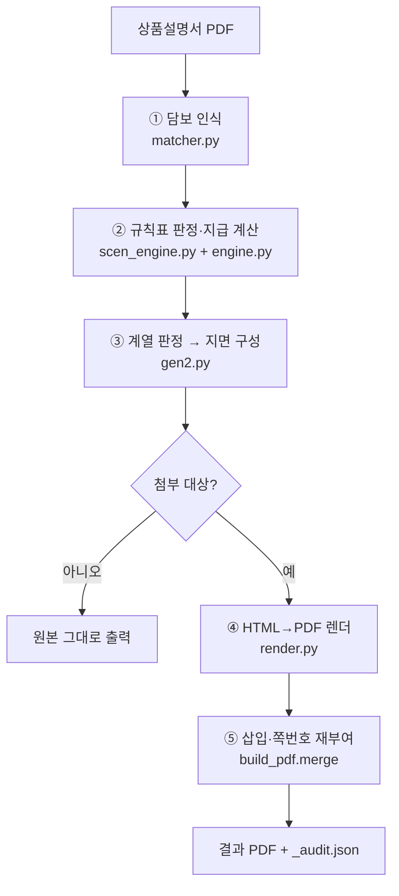
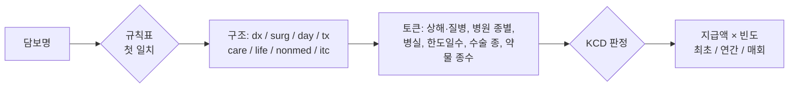

# 스마트 설명서 설계도 (proposal_smart v8.4)

2026-09-16 · 세일즈혁신TF

## 1. 한눈에

설계시스템이 뽑아 준 **상품설명서 PDF 한 장을 넣으면**, 고객이 실제로 가입한 담보만으로 **보상 시뮬레이션 지면(최대 9쪽)**을 만들어 담보사항이 끝나는 쪽 뒤에 끼워 넣고 쪽번호를 다시 매긴 **하나의 PDF**를 돌려준다. 사람이 하는 일은 없다.

| 구분 | 내용 |
| --- | --- |
| 입력 | 원본 상품설명서 PDF(가입담보리스트 표가 있는 메리츠 표준 양식). 담보 목록을 따로 넘기고 싶으면 `customer.json` |
| 출력 | 원본 + 스마트 지면이 합쳐진 PDF, 감사 로그 `_audit.json`(인식·매칭·제외 내역·보장 계열) |
| 핵심 원칙 | 코드에 특정 담보를 나열하지 않는다. **담보명 → 규칙표(rules.json)**로 보상 구조를 정하고, **질병코드(KCD) → 약관 데이터**로 지급 여부를 판정한다. 근거가 없는 담보는 계산하지 않고 로그에 남긴다 |
| 첨부 기준 | 암·뇌혈관·심장·통합치료비 계열이 하나도 없는 설계(운전자보험·치아보험 등 단일상품)는 스마트 지면을 만들지 않고 원본을 그대로 내보낸다 |

```
상품설명서.pdf ─▶ ① 담보 인식(matcher) ─▶ ② 규칙표 판정·지급 계산(scen_engine + engine)
              ─▶ ③ 계열 판정 → 지면 구성(gen2) ─▶ ④ HTML→PDF 렌더(render) ─▶ ⑤ 삽입·쪽번호(build_pdf.merge)
```

한 줄 실행: `python build_all.py 원본_상품설명서.pdf 결과.pdf`

## 2. 전체 구조도

다섯 단계가 순서대로 돌고, 각 단계는 자기 파일 하나와 데이터 원장만 본다. 어느 단계에서도 예외가 나면 그 담보만 제외하고 로그에 남기며 생성은 멈추지 않는다.



| 단계 | 파일 | 하는 일 | 쓰는 데이터 |
| --- | --- | --- | --- |
| ① 담보 인식 | `matcher.py` | 가입담보리스트 표를 셀 단위로 읽고(세부보장 표는 텍스트로), 고지유형 꼬리표를 떼어 특약 마스터와 매칭. 가입금액(1억5천만원·3천5백만원 등)을 만원으로 환산 | `db.json`, `rules.json goji_tags` |
| ② 지급 계산 | `scen_engine.py` | 담보명을 규칙표에 대조해 보상 구조(진단·수술·입원·치료·간병 등)를 정하고, 사례(질병코드·치료행위·병원·일수)에 대해 지급액을 계산 | `rules.json`, `db.json`의 약관 KCD, `g131.json` |
| ② 통합치료비 | `engine.py` | 통합치료비 12종은 약관 지급금액표를 그대로 계산(항목별 연간 1회·수술 1회당·연간 한도·1년 이내 50%) | `product_data.json` |
| ③ 지면 구성 | `gen2.py` | 설계에 있는 계열(암·뇌·심장·통합치료비·수술·입원·간병·상해·사망)을 판정하고, 있는 계열의 지면과 블록만 HTML로 만든다 | `style.css`, `extra2.css`, `icons.json` |
| ④ 렌더 | `render.py` | Chromium으로 A4 PDF를 만들고 지면 이탈·글자 잘림을 검사 | Playwright |
| ⑤ 삽입 | `build_pdf.py` | '보장보험료 합계'가 마지막으로 나오는 쪽(담보사항 끝) 뒤에 끼우고 원본 쪽번호를 새 총쪽수로 덧씌운다 | pypdf, reportlab |
| 지휘 | `build_all.py` | 첫 쪽에서 피보험자·보험료·상품명·담당자를 읽고 위 단계를 순서대로 호출. 생성 쪽수가 0이면 원본을 그대로 복사 |  |

## 3. 데이터 원장 4종

보상 판젵의 근거는 아래 네 파일에만 있다. 신상품·신담보는 코드를 고치지 않고 이 파일만 갱신하는 것이 원칙이다.

| 원장 | 파일 | 내용 | 출처·갱신 방법 |
| --- | --- | --- | --- |
| 특약 마스터 | `db.json` | 특약 951건(통합간편 307 · 케어프리 419 · 운전자 176 · 치아 49): 담보명, 카테고리, 약관 KCD 목록(481건 보유), 검색 태그 | 특약검색기 `tool.html`에 들어 있는 DATA에서 `python extract_db.py ../tool.html`로 재생성. tool.html을 고치면 이 한 줄로 마스터가 따라간다 |
| 규칙표 | `rules.json` | 규칙 66개(담보명 정귙식 → 보상 구조·지급 방식·KCD 판정 모드), 약관 별표 분류표(`kcd_groups`: 특정소액암·특정소화기암·14대특정암·4대고액암·특정 5대질병), 고지유형 꼬리표(`goji_tags`) | 사람이 직접 관리. 신담보는 규칙 1줄, 신고지유형은 꼬리표 1단어 추가 |
| 약관 금액표 | `product_data.json` | 통합치료비 12종의 가입금액별 항목 금액표, 특정순환계 52·주요손상 40·암전후 60 질병코드, 암종 동의어 | 통합치료비 시뮬레이터 `통합치료비.html`에서 `python extract_data.py ../통합치료비.html` |
| 1-7종 수술분류표 | `surg7.json` | 약관 별표3 수술코드 630개 · 수술구분 266개 · 종(1~7). 사례의 수술은 이 코드로 종을 판정한다(v8.5) | 별표 PDF에서 `python extract_surg7.py 별표3.pdf` |
| 질병군표 | `g131.json`, `inj_itc.json` | 131대질병수술비 그룹별 KCD(다번도 64대·특정 31대 등 9그룹), 상해 통합치료비 금액표 | 수술비 보장 분석 엑셀·약관 별표에서 수작업 |

**이번 최종 검수에서 맞춘 것**: 영업지원도구 검수로 tool.html의 질병코드가 보정된 뒤(신장암 C64 누락 등) 모듈의 db.json은 예전 값을 들고 있었다. 재생성하여 특약 47건의 KCD 목록과 1건의 카테고리가 바뀌었고(통합암진단비·26종 항암치료비·암 통합치료비·유사암수술비 계열), 약관 금액표는 변화가 없었다. 앞으로 두 도구를 고치면 위 재생성 막을 같이 돌린다.

## 4. 보상 시뮬레이션 판정 규칙

담보 하나가 사례 하나에 얼마를 지급하는지는 세 간단으로 정해진다: **구조**(규칙표) → **조건**(담보명 토큰) → **질병코드**(약관 데이터).



| 간단 | 규칙 | 예 |
| --- | --- | --- |
| 구조 | 규칙표 66개를 위에서부터 훈어 첫 일치 규칙의 종류(kind)로 계산 방식을 정한다. 이름이 같은 통합치료비는 규칙표 앞에서 약관 금액표 엔진으로 보낸다 | `암진단비(유사암제외)` → dx_cancer_major(진단비, 암 전용) |
| 조건 | 담보명에서 상해/질병, 상급종합/종합/요양병원, 1인실/2-3인실, N일한도, N일이상, [질병5종], (plus), [2종이상], 연간1회한을 자동으로 읽어 사례와 대조 | `1인실 상급종합병원 질병입원일당(10일한도)` 14일 입원 → 10일만 |
| 질병코드 | major/sim(별표3 암 분류 로직) · codes(마스터 약관 KCD) · g131(질병군표) · group(별표13 분류표) · none. 목록이 없으믄 **지급하지 않고 로그** | 위암 C16 → 통합암진단비는 특정소화기암 급부만 |
| 조건부 담보 | 두 치료를 모두 받아야(특정혈전치료비), 약물이 N종 이상이어야(표적항암), 연간 N회 이상이어야(통합치료 생활비) 지급되는 담보는 조건을 채운 사례에서만 계산(보수적) | 표적 1종 사용 → [2종이상] 담보 0원 |
| 병원 종별 | 상급종합병원은 종합병원 중에서 지정되므로 상급종합 입원 시 종합병원 조건 담보도 함께 지급 | 1인실 상급종합 11만×10일 + 1인실 종합 10만×14일 |
| 배태 | 131대질병수술비 등 일반 질병 담보는 암·유사암 제외, 질병수술비(특정 5대질병 제외)는 백내장·대장용종 등 제외 |  |

지급 빈도는 담보별로 **최초 1회 / 연간 1회 / 수술할 때마다** 세 가지를 가지며, 지면의 표는 이 세 행으로 합산해 보여준다. 모든 계산은 진단비를 뿐 **순수 치료 보장액**으로 표기하고 진단비는 카드에 따로 쓴다.

## 5. 지면 구성 규칙

설계를 훈어 계열 유무를 먼저 판정하고, 있는 계열의 지면과 블록만 만든다. 지면 번호와 쪽번호는 실제 생성된 것만으로 다시 매긴다.

**계열 판정** (`gen2.coverage_flags`): 암 · 뇌혈관 · 심장 · 통합치료비 · 일반 수술비(질병/상해) · 입원일당 · 간병 · 상해 · 사망/후유장해. 담보의 규칙 종류, 마스터 카테고리, 통합치료비 id, 담보명 핵심어를 합쳐 판정한다. 암 전용 수술비·뇌심 전용 수술비는 일반 수술비로 세지 않고 해당 계열에서 다룬다.

**첨부 여부**: 암·뇌혈관·심장·통합치료비 중 하나도 없으면 지면을 만들지 않는다(`ATTACH_KEYS` 한 줄로 변경). 운전자보험·치아보험은 이 기준에서 자연히 제외된다.

| 지면 | 나오는 조건 | 안에서 조건부인 블록 |
| --- | --- | --- |
| 보장 한장요약 | 첨불 대상이면 항상 | 요약 카드 5종(암·뇌·심·수술·입원간병)이 계열별로, 열 수 자동 |
| 암 세부보장 | 암 | — |
| 뇌혈관 · 심혈관 보장 | 뇌 또는 심장 | 뇌 블록 / 심장 블록 / 치료 흐름 3종(뇌경색·뇌출혈·심근경색) 각각 |
| 뇌·심혈관 질병코드 지도 | 뇌 또는 심장 | 뇌 지도 / 심장 지도 / 두 통합치료비 커버율(순환계 통합치료비 가입 시) |
| 통합치료비 한눈에 | 통합치료비 | 가입한 그룹(암·순환계·주요손상·암전후)만 |
| 수술비 · 입원일당 | 일반 수술비 또는 입원일당 또는 간병 | 입원·간병 그리드(병실 무관 일반 입원 카드 포함) / 수술 종별 표(질병 행·상해 행) / plus / 질병군 추가 수술비 / 1-7종 |
| 다번도 질환 수술 시뮬레이션 | 일반 질병 수술비 | — |
| 사례로 보는 치료비 보장 | 암·뇌·심장 중 하나 | 폐암 / 뇌경색 / 급성심근경색 카드 각각 |
| 상해 · 사고와 사망 · 후유장해 | 상해 또는 사망/후유장해 또는 상해 통합치료비 | 상해 예시 / 상해 통합치료비 / 사망·후유장해 카드 · 보장 시작 시점은 항상 |

삽입 위치는 원본에서 '보장보험료 합계'가 마지막으로 나오는 쪽(담보사항 상세 표의 끝) 뒤이고, 헤더·푸터(상품명·계약사항·영업담당자·발행정보·콜센터)는 원본 첫 쪽에서 읽어 같은 양식으로 찍는다.

## 6. 최종 검수 결과 (2026-09-16, v8.4 + 마스터 재생성)

44세 여성 The건강한 5.10.5 설계(담보 151건)는 보정된 마스터로 다시 만들어도 9쪽 숫자가 그대로이고, 계열을 물리거나 단일상품을 넣어도 지면이 맞게 줄어든다.

| 설계 | 담보 | 생성 쪽수 | 결과 |
| --- | --- | --- | --- |
| 44F The건강한 5.10.5 (실제) | 151 | 9 | 원본 56쪽 → 65쪽. 9쪽 텍스트가 이전 마스터 기준 결과와 동일(입원 그리드에 질병입원일당 1만원 카드가 새로 나타난 것만 다름). 감사 로그 동일 |
| 40M 통합간편 (cust_a) | 70 | 9 | 예외 없음 |
| 40F The건강한 (cust_b) | 66 | 9 | 예외 없음 |
| 44F에서 암 계열 제거 | 96 | 8 | 암 세부보장 제외, 폐암 사례 제외, 요약카드 4열 |
| 44F에서 통합치료비 제거 | 145 | 8 | 통합치료비 한눈에 제외 |
| 44F에서 수술비·입원일당·간병 제거 | 75 | 7 | 수술비 지면·다번도 지면 제외 |
| 44F 암 계열만 | 51 | 4 | 한장요약 · 암 · 통합치료비 · 사례(폐암만) |
| 담보 5건 소형 | 5 | 6 | 뇌·심 지면·통합치료비 제외, 입원 그리드에 일반 입원 42만원 표기 |
| 운전자 전용 60건 | 60 | 0 | **미첨부** — 원본 56쪽 그대로 출력 |
| 치아 전용 49건 | 49 | 0 | **미첨부** |
| 마스터 951건 전체 | 951 | 9 | 예외 없이 생성(한장요약은 넘침 — 실제 설계 범위 밖) |

그 외 확인: 특약 마스터 951건 전수 재분류 미분류 0건 · Python 3.10·3.11·3.12·3.13 컴파일 통과 · 가상 설계서(1억5천만원·갱신주기 중복·원 단위 금액)로 금액 파싱·중복 제거 확인 · 약관 금액표는 시뮬레이터 최신본과 동일.

**남은 과제** (검수보고서 B그룹, 데이터·표기 정비)

- 26종 항암방사선및약물치료비의 암종 분류표를 규칙표로 옮기기(현재 26개 급부 중 18개가 계산 제외·로그)
- 10대특정암 분류표 확보, 마스터 KCD 공백 470건 보강
- 한장요약 진단 카드의 기준 질병(위암·뇌경색·심근경색) 표기, 세부급부 26행 합산 표기 정불
- 지면 이탈 검출 시 벌드 중단(현재는 경고만), 쪽번호 덧씌기의 텍스트 칵 잔존
- 준법감시 심의·심의번호 위치

## 7. 실행 · 운영 절차와 소스코드

**소스코드 위치**: GitHub 저장소 `hunx11-sys/MeAI`, 뿌리 `claude/smart-proposal-auto-attach-review-nic5sa`, 폴더 `proposal_smart/` (코드 8개 · 데이터 8개 · 스타일 3개 · README). 검수보고서는 `docs/검수보고서_스마트제안서_v8.md`. 같은 내용을 zip(`proposal_smart_code_v8.4.zip`)으로도 대화에 보내 뒤었다.

| 준비 | 명령 |
| --- | --- |
| Python 3.10 이상 + 패키지 | `pip install -r requirements.txt` |
| 렌더용 바라우저 | `python -m playwright install chromium` |
| 글꼴·아이콘·로고 (1회) | `python fetch_assets.py 원본.pdf` |
| 실행 | `python build_all.py 원본_상품설명서.pdf 결과.pdf` → 결과.pdf와 `out/_tmp_audit.json` |

**신상품·신담보 대응**

1. 특약검색기 tool.html에 신담보·질병코드를 넣고 `python extract_db.py ../tool.html` → 마스터 갱신
2. 감사 로그에 `미분류`가 나오면 `rules.json`에 규칙 1줄(담보명 정귙식 + 구조 + KCD 모드) 추가
3. `KCD없음`이 나오면 그 담보의 약관 KCD를 tool.html에 보강(그러면 1번으로 따라온다)
4. 새 고지유형 꼬리표(예: 유병자가입)는 `rules.json goji_tags`에 단어 하나 추가
5. 새 통합치료비는 시뮬레이터에 금액표를 넣고 `python extract_data.py ../통합치료비.html`

어느 단계도 파이썬 코드를 고치지 않는다. 감사 로그(`_audit.json`)의 `제외지면`·`보장계열`·`로그`만 보도 이 설계가 왜 이 지면으로 나왔는지 추적할 수 있다.


---
원본 문서(Claude Docs, 댓글·수정 가능): https://claude.ai/code/artifact/73ed31b8-2125-4e0f-9e0e-ea27acbd571d
